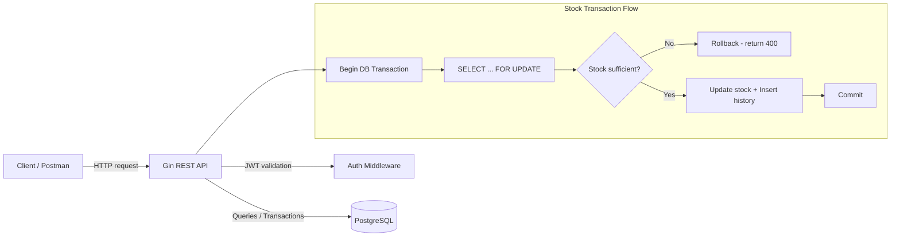
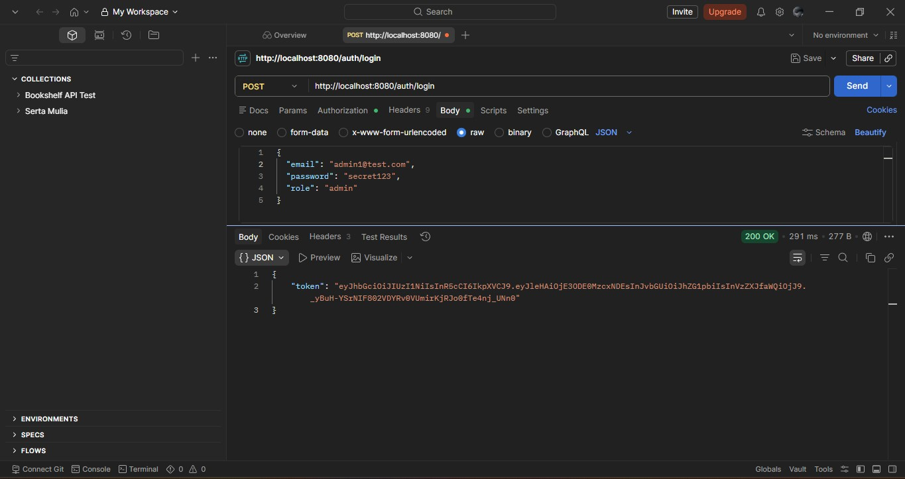
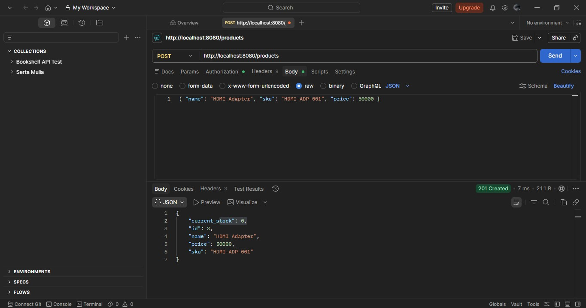
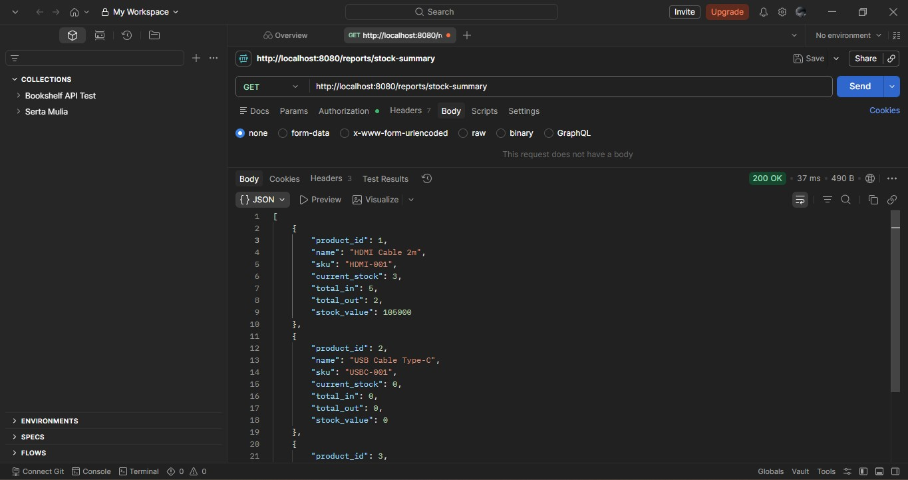

<div align="center">


<a href="https://github.com/golang/go">
  
</a>
<a href="https://gin-gonic.com/">
  
</a>
<a href="https://www.postgresql.org/">
  
</a>
<a href="https://www.docker.com/">
  
</a>

<br/>


</div>

---

## 📦 About

**WMS (Warehouse Management System)** is a backend REST API for managing product inventory. The core focus of this project is **safe, atomic stock transactions** - every stock movement (IN/OUT) is processed inside a database transaction with **row-level locking (`SELECT ... FOR UPDATE`)** to prevent race conditions when multiple requests modify the same product's stock at the same time.

This project is built as a backend portfolio piece to demonstrate:

- ✅ RESTful API design with Gin
- ✅ JWT authentication & role-based authorization (admin/staff)
- ✅ Database transactions & row-level locking for concurrency safety
- ✅ Auto-migration on startup
- ✅ Dockerized setup (app + database in one command)

---

## 🏗️ Architecture



---

## 🚀 Tech Stack

| Component | Technology |
|---|---|
| Language | Go 1.22 |
| Web Framework | Gin |
| Database | PostgreSQL |
| Auth | JWT (golang-jwt) |
| Password Hashing | bcrypt |
| Containerization | Docker & Docker Compose |

---

## 📁 Project Structure

```
wms/
├── main.go                    # entry point
├── config/database.go         # DB connection + auto-migration
├── models/models.go            # structs & request payloads
├── middleware/auth.go          # JWT auth & admin-only middleware
├── handlers/
│   ├── auth_handler.go         # register & login
│   ├── product_handler.go      # product CRUD + history
│   ├── transaction_handler.go  # atomic stock transactions
│   └── report_handler.go       # stock summary report
├── routes/routes.go            # route definitions
├── postman/                     # Postman collection for testing
├── Dockerfile
├── docker-compose.yml
└── README.md
```

> **Note on database schema**: tables are created automatically at startup via `RunMigrations()` in `config/database.go` (using `CREATE TABLE IF NOT EXISTS`), so no separate schema file or manual `psql` step is needed.

---

## ⚙️ Getting Started

### Option 1 - Run with Docker (recommended)

This spins up both the API and PostgreSQL with a single command, no manual setup needed.

```bash
git clone https://github.com/0xrayn/wms-lite.git
cd wms-lite
docker-compose up --build
```

The API will be available at `http://localhost:8080`. Tables are created automatically on startup.

### Option 2 - Run locally

Requires Go 1.22+ and a running PostgreSQL instance.

```bash
git clone https://github.com/0xrayn/wms-lite.git
cd wms-lite

# Setup environment variables
cp .env.example .env
# Edit .env to match your local PostgreSQL credentials

# Install dependencies
go mod tidy

# Run the app
go run main.go
```

---

## 📖 API Documentation

### Authentication

| Method | Endpoint | Description | Auth |
|---|---|---|---|
| POST | `/auth/register` | Register a new user | - |
| POST | `/auth/login` | Login and get JWT token | - |

**Register**
```json
POST /auth/register
{
  "email": "admin@example.com",
  "password": "secret123",
  "role": "admin"
}
```

**Login**
```json
POST /auth/login
{
  "email": "admin@example.com",
  "password": "secret123"
}
```

### Products

| Method | Endpoint | Description | Auth |
|---|---|---|---|
| POST | `/products` | Create a new product | Admin |
| GET | `/products` | List products (paginated, searchable) | Required |
| GET | `/products/low-stock` | List products below a stock threshold | Required |
| GET | `/products/:id/transactions` | Get stock movement history (paginated) | Required |

**Create Product**
```json
POST /products
Authorization: Bearer <token>

{
  "name": "HDMI Cable 2m",
  "sku": "HDMI-001",
  "price": 35000
}
```

**List Products**
```
GET /products?page=1&limit=10&search=hdmi
Authorization: Bearer <token>
```
Response:
```json
{
  "data": [ ... ],
  "pagination": { "page": 1, "limit": 10, "total": 42 }
}
```

**Low Stock Alert**
```
GET /products/low-stock?threshold=10&page=1&limit=10
Authorization: Bearer <token>
```
Returns products where `current_stock` is below `threshold` (default: 10), ordered by stock ascending.

**Transaction History**
```
GET /products/1/transactions?page=1&limit=10
Authorization: Bearer <token>
```

### Stock Transactions

| Method | Endpoint | Description | Auth |
|---|---|---|---|
| POST | `/transactions` | Record a stock IN/OUT transaction | Required |

**Create Transaction**
```json
POST /transactions
Authorization: Bearer <token>

{
  "product_id": 1,
  "type": "IN",
  "quantity": 50,
  "note": "Restock from supplier"
}
```

> If `type` is `OUT` and `quantity` exceeds available stock, the request is rejected with `400 Bad Request` and the transaction is rolled back - no partial updates ever happen.

### Reports

| Method | Endpoint | Description | Auth |
|---|---|---|---|
| GET | `/reports/stock-summary` | Stock summary with total IN/OUT & stock value | Required |
| GET | `/health` | Health check | - |

---

## 🔒 Concurrency Safety - The Core of This Project

The most important part of this codebase is `handlers/transaction_handler.go`. Every stock transaction follows this flow:

1. **Begin** a database transaction
2. **Lock** the product row with `SELECT ... FOR UPDATE` - any other transaction touching the same product must wait
3. **Validate** stock availability for `OUT` transactions
4. **Update** the product's `current_stock`
5. **Insert** a record into `stock_transactions` for audit history
6. **Commit** - or roll back automatically if any step fails

This guarantees that two simultaneous requests can never cause an inconsistent stock count.

---

## 🧪 Testing

Unit tests for the transaction handler use [go-sqlmock](https://github.com/DATA-DOG/go-sqlmock) to mock the database, covering:

- Stock IN success
- Stock OUT success
- Stock OUT rejected when stock is insufficient (rollback verified)
- Product not found

Run the tests with:

```bash
go test ./handlers/... -v
```

---

## 📸 Demo

Screenshots of the API tested via Postman:

**Login & get JWT token**



**Create stock transaction**



**Stock summary report**



---

## 🗺️ Roadmap

- [x] JWT auth & role-based access
- [x] Atomic stock transactions with row locking
- [x] Auto-migration
- [x] Dockerized setup
- [x] Pagination & filtering
- [x] Low-stock alert endpoint
- [x] Unit tests with sqlmock
- [ ] Deploy to Railway/Render

---

<div align="center">

</div>
